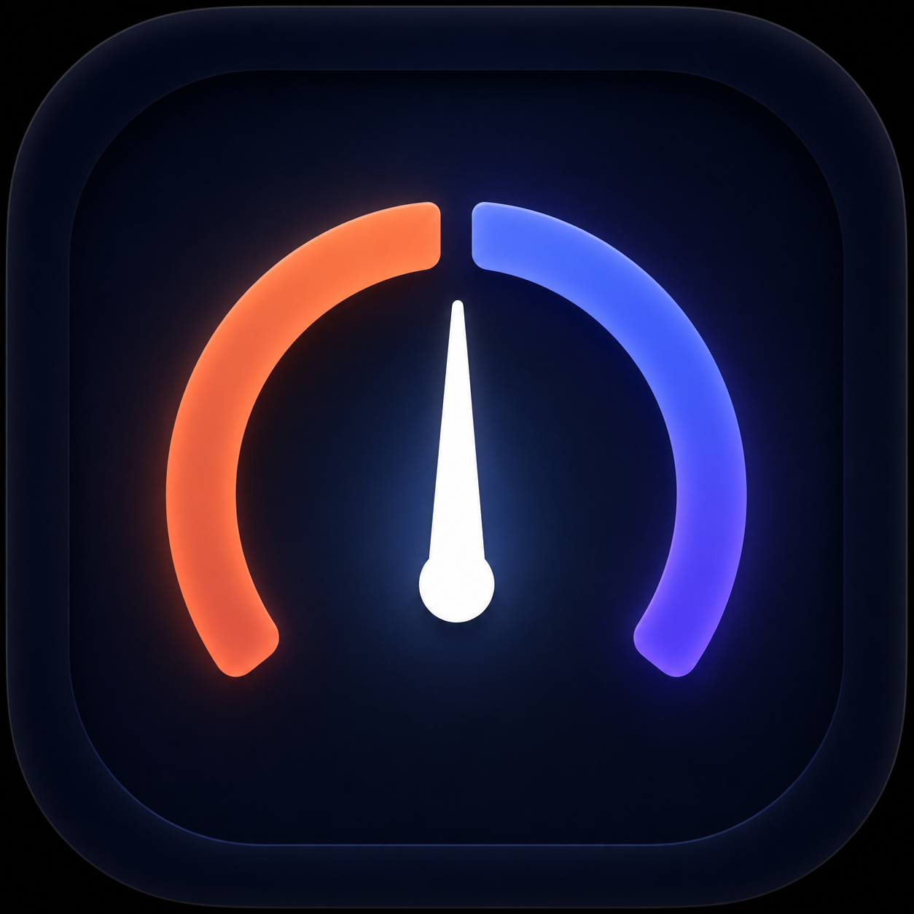
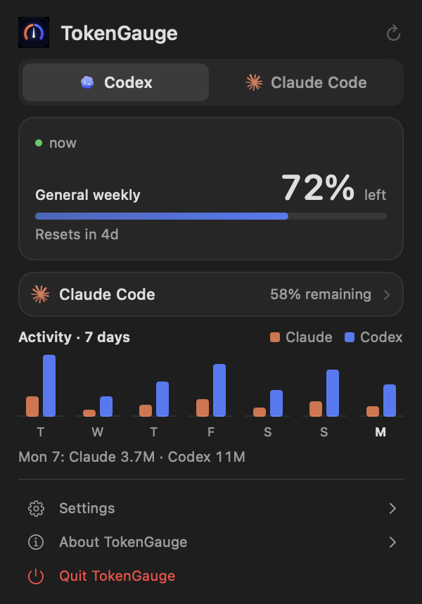
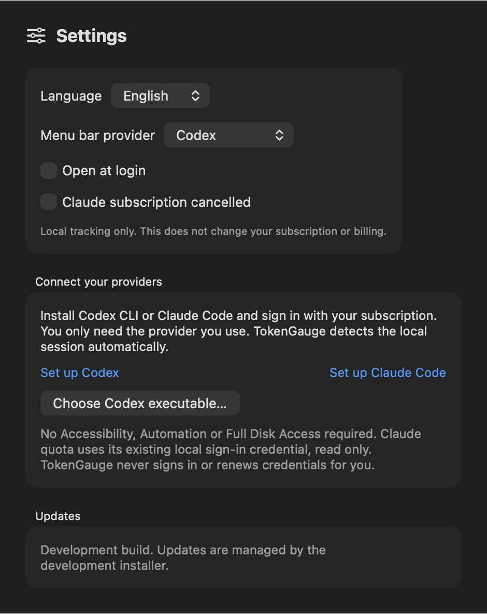

<p align="center">
  
</p>
<h1 align="center">TokenGauge</h1>
<p align="center">Your AI coding quota, one glance away.</p>
<p align="center">
  
  
  <a href="LICENSE"></a>
</p>

TokenGauge lives in your Mac’s menu bar and shows how much Claude Code or Codex quota you have left. Check reset times, compare seven days of activity, and keep a private local history without opening a terminal.

<p align="center">
  
  
</p>
<p align="center"><sub>App views rendered with synthetic demonstration data.</sub></p>

## At a glance

- **A readable menu bar:** your selected provider’s logo and remaining quota.
- **Separate limits:** general weekly quota and additional provider windows stay separate.
- **Seven days of activity:** daily Claude and Codex token totals, with hover or click details.
- **Local history:** aggregated usage survives trimmed provider logs.
- **English and Spanish:** follows your system language initially, with an explicit language choice in Settings.
- **Native updates:** daily checks, an inline install action, and manual checks in About.
- **No telemetry, ads, or model requests.**

## Install and connect

Requires **macOS 14 or later and an Apple Silicon Mac**. Intel builds are not currently distributed.

1. Download the DMG from [Releases](https://github.com/StevenACZ/TokenGauge/releases).
2. Drag TokenGauge to Applications and open it. The app appears in the menu bar.
3. Install and sign in to [Codex CLI](https://developers.openai.com/codex/cli/) or [Claude Code](https://code.claude.com/docs/en/quickstart) with the subscription you use. You do not need both.
4. Select your provider in TokenGauge. It refreshes automatically; use the header refresh button to check immediately.

If Codex was installed using a custom npm prefix, nvm, asdf, or Volta and is not detected, use **Settings → Choose Codex executable…** to select the executable you use in Terminal. Automatic detection can be restored from the same row.

TokenGauge is a usage viewer, not a replacement for either provider. On a Mac without a signed-in provider, it shows an unavailable/sign-in state and keeps the setup links accessible in **Settings**. It never invents a balance or asks for an API key.

**Permissions:** no Accessibility, Automation, Screen Recording, or Full Disk Access is needed. Launch at login is optional. Claude quota requires reading Claude Code’s existing OAuth credential from the macOS Keychain; macOS may request access depending on that item’s access policy. TokenGauge does not create, renew, rotate, or export the credential. Sign-in stays in Claude Code.

### Updates

Release builds check for updates daily. When one is available, choose **Install update** in the panel or **About TokenGauge**. Download progress appears inline, then the app relaunches. Automatic checking can be disabled in Settings; manual checks live in About. There are no separate Sparkle update windows.

Updates use [Sparkle](https://sparkle-project.org), a signed ZIP, and an EdDSA-signed appcast on GitHub Releases. Development builds stay off the public update channel.

### What the numbers mean

The menu bar shows the selected provider’s current balance. Codex uses its general quota; a separate Luna reserve is displayed independently and is never added to it. Claude uses its tightest scoped weekly limit, falling back to the general weekly limit. Token activity totals are not quota percentages. Provider windows and account availability depend on your plan and may change upstream.

If a live read fails, historical balances are not presented as current quota. Authentication required, denied access, stale data, and a locally marked cancelled subscription remain distinct. Marking Claude cancelled in Settings only changes local tracking; it does not cancel billing.

## Privacy

Codex metrics come from the local `codex app-server` account methods. Claude quota comes from its read-only usage endpoint, using the existing credential only in memory. This integration depends on provider behavior and is not an official provider product.

Local activity scans decode timestamps, message IDs, model identifiers, and numeric counters. Prompt and response fields are not decoded, logged, or persisted. Only normalized metrics and aggregate history are saved under `~/Library/Application Support/TokenGauge`, with user-only permissions. No usage is sent to a TokenGauge server. Provider quota requests contact the provider, and update checks contact GitHub.

See [SECURITY.md](SECURITY.md) for reporting and update-channel details.

## Build from source

Use Xcode/Swift **6.2 or newer** on macOS. No Node, Homebrew runtime, or web service is required.

```sh
make ci-check
make install-dev
```

The development installer requires an Apple Development signing identity and installs to `~/Applications/TokenGauge.app`. It does not modify Claude Code’s configuration. To stage a local bundle without installing, use `make stage`.

The optional `scripts/install_claude_statusline.sh` supports an existing shell status-line script containing `input=$(cat)`. It adds a normalized quota capture fallback and creates a backup; it is not needed for normal live quota reads. It refuses unsupported scripts instead of overwriting a custom setup. Do not replace someone’s status-line configuration merely to enable the fallback.

[Release guide](docs/RELEASING.md) · [Contributing](CONTRIBUTING.md) · [Changelog](CHANGELOG.md)

## Credits

Created by **StevenACZ**. Also see [SapoWhisper](https://github.com/StevenACZ/SapoWhisper), [Encaje](https://github.com/StevenACZ/Encaje), and [MacGauge](https://github.com/StevenACZ/MacGauge).

TokenGauge is independently developed and is not affiliated with OpenAI or Anthropic. Provider names and marks belong to their respective owners. Source code is [MIT licensed](LICENSE); Sparkle notices are included in [docs/licenses](docs/licenses).
